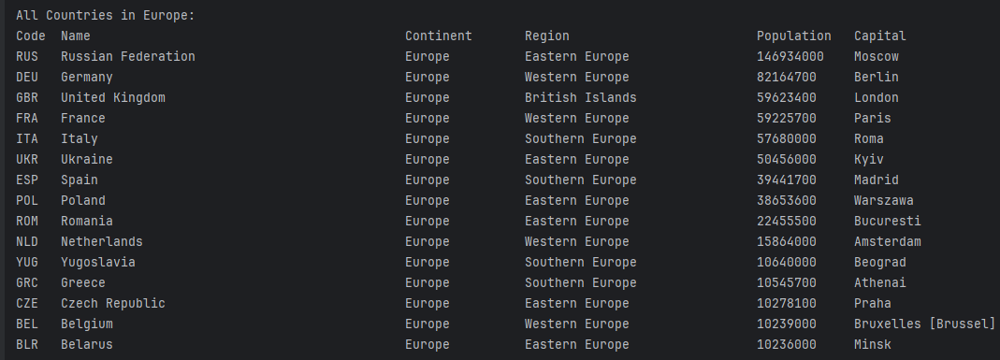
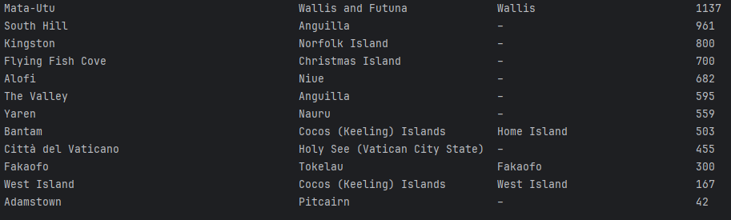
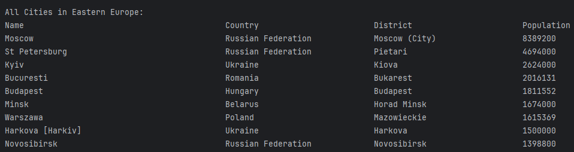

# Population Reporting System

The **Population Reporting System** is a group project for the Software Engineering Methods module at Edinburgh Napier University.
This project aims to design and implement a system that allows access to population information from an SQL database.

## Technologies Used

- Java (JDK 11)
- SQL Database
- Maven
- Docker
- Git/GitHub
- CodeCov
- JUnit

## Badges

#### Master Build Status

#### Develop Build Status

#### Codecov Coverage

#### Release Status

#### License Status

## Requirements Met:

| ID  | Name                                                                                                                                                                                               | Met | Screenshot                                                                                                                       |
|-----|----------------------------------------------------------------------------------------------------------------------------------------------------------------------------------------------------|-----|----------------------------------------------------------------------------------------------------------------------------------|
| 1   | All the countries in the world organised by largest population to smallest.                                                                                                                        | Yes |        |
| 2   | All the countries in a continent organised by largest population to smallest.                                                                                                                      | Yes |        |
| 3   | All the countries in a region organised by largest population to smallest.                                                                                                                         | Yes |                                                                         |
| 4   | The top `N` populated countries in the world where `N` is provided by the user.                                                                                                                    | Yes |                                                                         |
| 5   | The top `N` populated countries in a continent where `N` is provided by the user.                                                                                                                  | Yes |                                                                         |
| 6   | The top `N` populated countries in a region where `N` is provided by the user.                                                                                                                     | Yes |                                                                         |
| 7   | All the cities in the world organised by largest population to smallest.                                                                                                                           | Yes |        |
| 8   | All the cities in a continent organised by largest population to smallest.                                                                                                                         | Yes |        |
| 9   | All the cities in a region organised by largest population to smallest.                                                                                                                            | Yes |        |
| 10  | All the cities in a country organised by largest population to smallest.                                                                                                                           | Yes |    |
| 11  | All the cities in a district organised by largest population to smallest.                                                                                                                          | Yes |                                                                       |
| 12  | The top `N` populated cities in the world where `N` is provided by the user.                                                                                                                       | Yes |                                                                       |
| 13  | The top `N` populated cities in a continent where `N` is provided by the user.                                                                                                                     | Yes |                                                                       |
| 14  | The top `N` populated cities in a region where `N` is provided by the user.                                                                                                                        | Yes |                                                                       |
| 15  | The top `N` populated cities in a country where `N` is provided by the user.                                                                                                                       | Yes |                                                                       |
| 16  | The top `N` populated cities in a district where `N` is provided by the user.                                                                                                                      | Yes |                                                                       |
| 17  | All the capital cities in the world organised by largest population to smallest.                                                                                                                   | Yes |    |
| 18  | All the capital cities in a continent organised by largest population to smallest.                                                                                                                 | Yes |    |
| 19  | All the capital cities in a region organised by largest to smallest.                                                                                                                               | Yes |                                                                       |
| 20  | The top `N` populated capital cities in the world where `N` is provided by the user.                                                                                                               | Yes |                                                                       |
| 21  | The top `N` populated capital cities in a continent where `N` is provided by the user.                                                                                                             | Yes |                                                                       |
| 22  | The top `N` populated capital cities in a region where `N` is provided by the user.                                                                                                                | Yes |                                                                       |
| 23  | The population of people, people living in cities, and people not living in cities in each continent.                                                                                              | Yes |                                                                       |
| 24  | The population of people, people living in cities, and people not living in cities in each region.                                                                                                 | Yes |                                                                       |
| 25  | The population of people, people living in cities, and people not living in cities in each country.                                                                                                | Yes |    |
| 26  | The population of the world.                                                                                                                                                                       | Yes |                                                                       |
| 27  | The population of a continent.                                                                                                                                                                     | Yes |                                                                       |
| 28  | The population of a region.                                                                                                                                                                        | Yes |                                                                       |
| 29  | The population of a country.                                                                                                                                                                       | Yes |                                                                       |
| 30  | The population of a district.                                                                                                                                                                      | Yes |                                                                       |
| 31  | The population of a city                                                                                                                                                                           | Yes |                                                                       |
| 32  | The number of people who speak the following the following languages from greatest number to smallest, including the percentage of the world population: Chinese, English, Hindi, Spanish, Arabic. | No  | N/A                                                                                                                              |